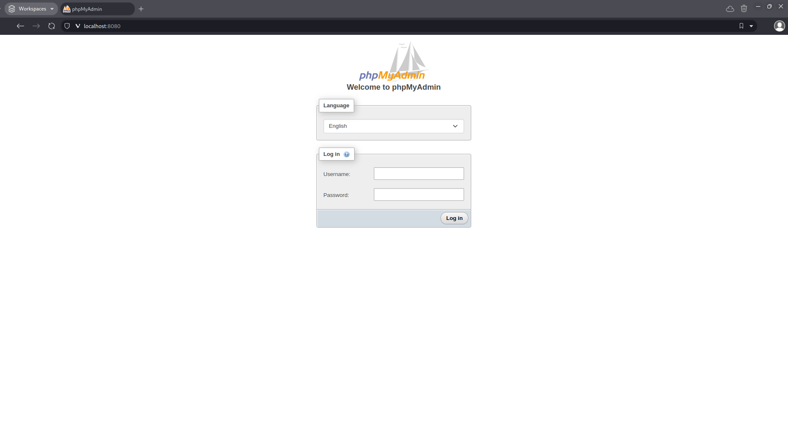
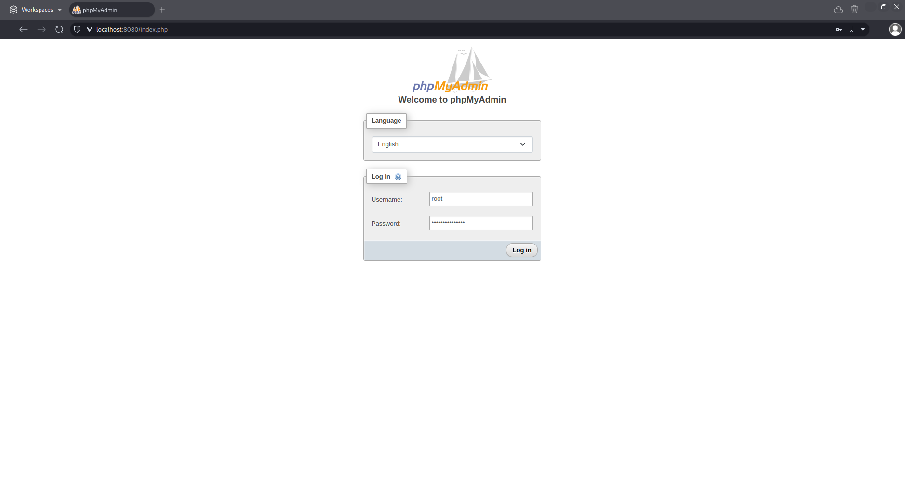

# forestry-club
Hour tracking for Green River College's Forestry Club

## Specific documents

[Troubleshooting](documentation/TROUBLESHOOTING.md)

[Developer Information](documentation/DEVELOPER.md)

## Prerequisites

node - [nodejs.org/en/download](nodejs.org/en/download)

npm - [docs.npmjs.com/downloading-and-installing-node-js-and-npm](docs.npmjs.com/downloading-and-installing-nodejs-and-npm)

## Installation
> Setup Files
> - Run commands in the directory that the project will live in (in order)
>> `git clone https://github.com/GreenThumbGRC/forestry-club.git`
> 
>> `docker compose up -d`
> 
>> `cd forestry-club-hours-tracker`
> 
>> `npm i`
> 
>> `npm run server`
> 
>> Open second terminal & navigate to current directory\
>> `npm run dev`
> 
>  ### SQL Database Setup
>> #### Navigate to localhost:8080
>> 
> 
>> #### Login as root
>> 
> 
>> #### Give permissions to forestry_user
>> \
>> \
>> 
> 
>> #### Add table schema
>> \
>> \
>> \
>> \
>> 
