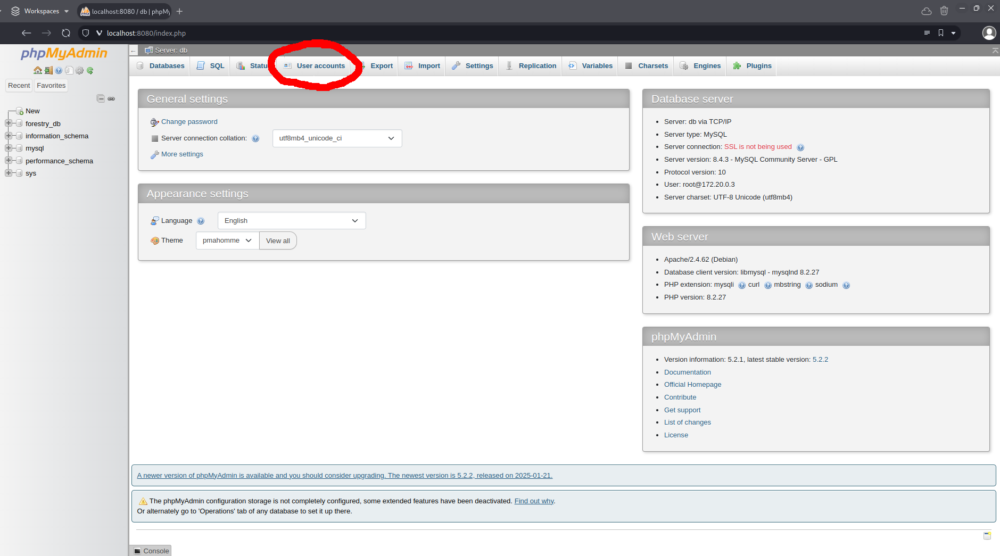
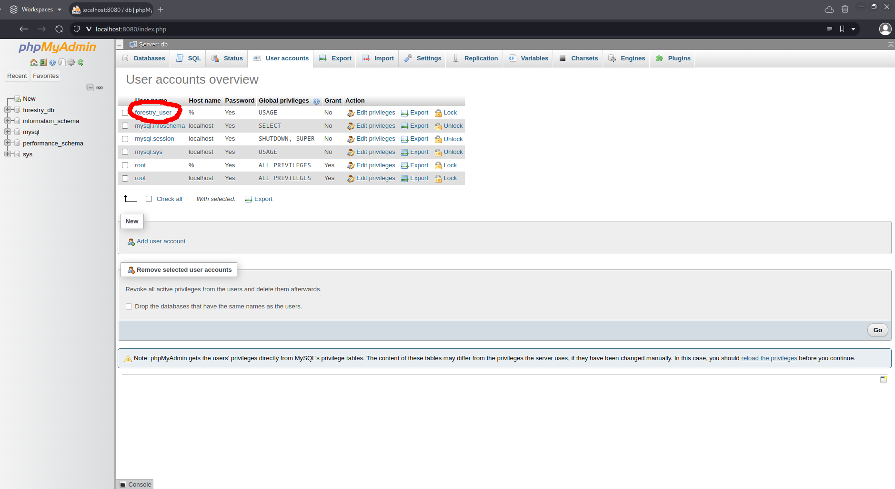
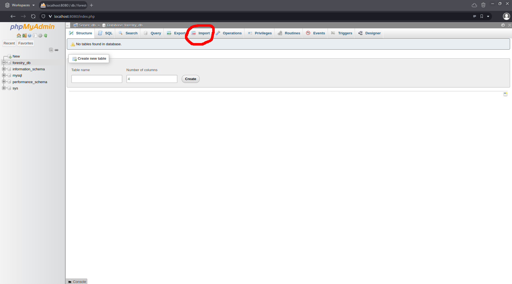
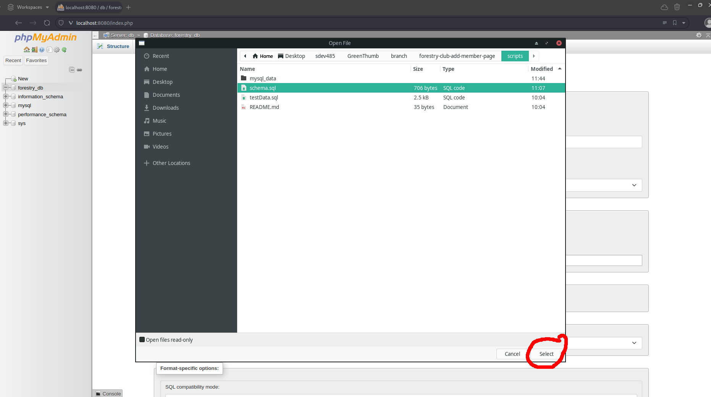
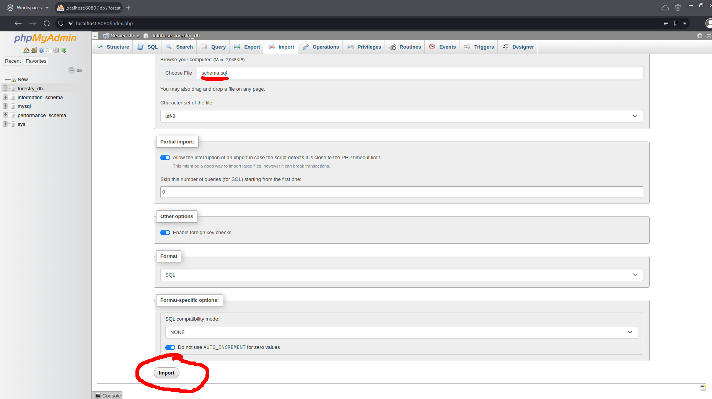

# Developer Documentation

## Technology Overview

### TODO - Add diagram here

### Technology list

| Front-end | Back-end | Database | Other  |
| --------- | -------- | -------- | ------ |
| React     | PHP      | MySQL    | npm    |
| MUI       |          |          | day.js |
|           |          |          | Vite   |

### Technology quick-reference

[React](https://react.dev/reference/react) - Front-end Javascript library to assist in building user interfaces based on components.

[MUI](https://mui.com/material-ui/getting-started/) - Material UI is an open-source React component library. Used for tables and other site components.

[PHP](https://www.php.net/) -  Fast, flexible Back-end scripting language chosen for it's compatibility with low cost hosting platforms.

[day.js](https://day.js.org/) - Light weight javascript library used to make date calculations easier.

## Site setup guide

Should you...
### Site file setup

### Database setup
>> #### Give permissions to forestry_user
>> \
>> \
>> 
> 
>> #### Add table schema
>> \
>> \
>> \
>> \
>> 